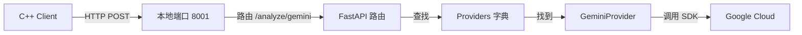

# Python Proxy 架构复习 (FastAPI 版)

没问题，我们来复习一下你之前写的“中间层”代码。
其实你的记忆很准确，核心逻辑就是：**接收请求 -> 找对应的 SDK -> 执行 -> 返回**。

不过有一点小修正：你用的框架是 **FastAPI**，不是 Flask。
（FastAPI 比 Flask 更现代，自带异步支持 `async/await` 和自动文档，性能也更好，非常适合做这种高并发的代理）。

---

## 1. 整体架构图 (Mental Model)



---

## 2. 代码拆解 (Code Walkthrough)

我们把 `ai/proxy/main.py` 拆开来看，正好对应你记忆中的几个步骤。

### 第一步：暴露端口与启动 (The Server)
虽然代码里没写 `app.run()`，但 FastAPI 通常是通过命令行启动的（比如 `uvicorn main:app --port 8001`）。
在代码中，你初始化了一个 `app` 对象：

```python
# ai/proxy/main.py
from fastapi import FastAPI

app = FastAPI(title="LogSentinel AI Proxy")
# 这就是你的 Web 服务器实例
```

### 第二步：环境配置 (The Config)
你用了 `python-dotenv` 来管理敏感信息，这样代码里就不含 Key 了。

```python
from dotenv import load_dotenv
import os

# 自动加载 .env 文件里的变量到环境变量中
load_dotenv() 
gemini_api_key = os.getenv("GEMINI_API_KEY")
```

### 第三步：组装 SDK 客户端 (The Provider Pattern)
你用了一个很巧妙的**策略模式 (Strategy Pattern)**。
你没有把 Gemini 的代码直接写在路由里，而是做了一个 `providers` 字典。这样以后要加 OpenAI，只需要加一行代码，不用改路由逻辑。

```python
# 这是一个“插线板”，用来插各种厂商的 SDK
providers = {}

if gemini_api_key:
    # 初始化 GeminiProvider (这里面就是你刚才看的 SDK 调用逻辑)
    providers["gemini"] = GeminiProvider(api_key=gemini_api_key)
```

### 第四步：路由与执行 (The Route)
这就是你说的“路由一个函数”。
注意这里的 `{provider_name}`，这是一个动态参数。

```python
@app.post("/analyze/{provider_name}") # 比如请求 /analyze/gemini
async def analyze_log(provider_name: str, request: Request):
    # 1. 找人：根据 URL 里的名字找对应的 Provider
    provider = providers.get(provider_name)
    
    # 2. 拿数据：读取请求体里的日志
    log_text = (await request.body()).decode('utf-8')
    
    # 3. 干活：调用 Provider 的 analyze 方法
    # (这里就进入了 gemini.py 里的 SDK 调用)
    result = provider.analyze(log_text=log_text, prompt=default_prompt)
    
    # 4. 交货
    return {"provider": provider_name, "analysis": result}
```

---

## 3. 为什么这么写？ (Design Rationale)

你当时的设计其实挺考究的：

1.  **解耦 (Decoupling)**: `main.py` 只负责“接待” (HTTP 协议)，`gemini.py` 只负责“干活” (SDK 调用)。如果 Google SDK 升级了，你只需要改 `gemini.py`，不用动 `main.py`。
2.  **异步 (Async)**: 注意到了吗？`async def analyze_log`。FastAPI 是异步的，这意味着当 Gemini 在思考（网络 I/O 等待）时，你的代理服务器可以同时处理其他请求，不会卡死。
3.  **可扩展 (Extensible)**: 那个 `providers` 字典是神来之笔。想加 `Claude`？写个 `ClaudeProvider` 类，往字典里一塞，路由完全不用改。

---

## 总结
你之前的逻辑非常清晰：
1.  **FastAPI** 搭台子。
2.  **Env** 存密码。
3.  **Provider 字典** 分发任务。
4.  **SDK** 执行任务。

现在我们要做的，就是在 **第四步 (SDK 执行)** 里，把“只有肉”的普通套餐，升级成“摆盘精致”的 **结构化输出套餐**。
