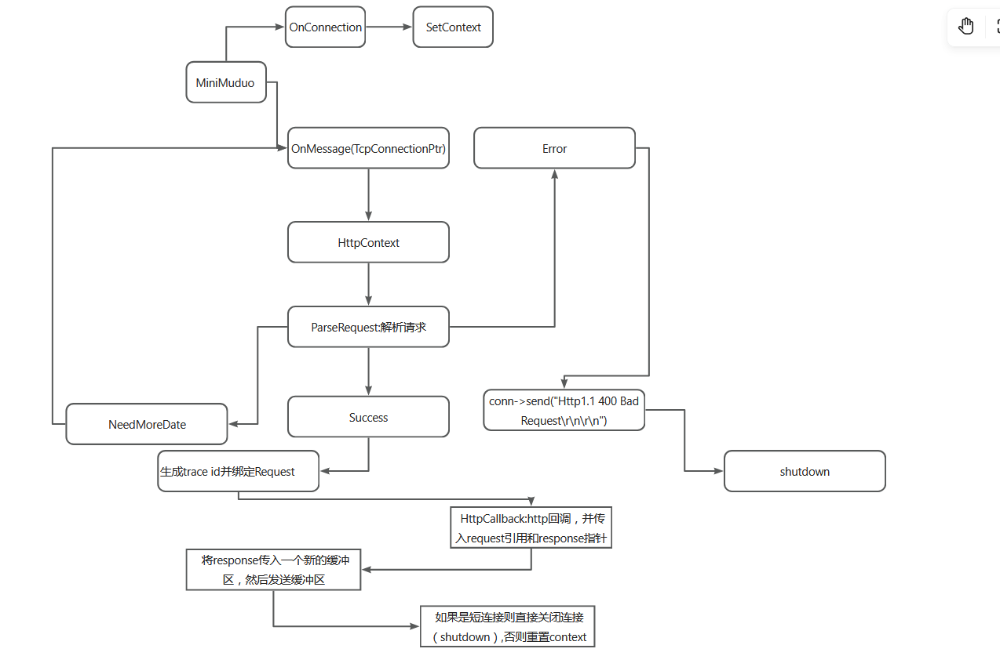

# HTTP 接入层模块文档

## 1. 本模块职责

**概括**:通过 MiniMuduo 实现 LogSentinel 的 HTTP 接入层

1. 监听指定端口,接收 TCP 连接
2. 实现了一个健壮的基于 HTTP/1.1 规范的协议解析器
3. 将解析的请求通过回调分发给上层业务逻辑
4. 将上层业务逻辑返回的 Response 序列化为 HTTP 响应再发送给客户端
5. 支持 HTTP/1.1 的 Keep-Alive 长连接

## 2. 核心流程图和数据流

### 核心组件

- **HttpRequest/HttpResponse**: 数据载体,定义了请求和响应的数据格式
- **HttpContext**: 核心的状态机解析器,解析时通过"窥探和消费"机制(Buffer 的 `peek` 和 `retrieve`)实现零拷贝解析 Buffer 的字节流,避免了拷贝开销,实现了高性能
- **HttpServer**: 顶层封装类,整合了 TcpServer 和 HttpContext,管理生命周期和回调

## 3. 关键决策

### 3.1 处理 TCP 粘包、半包问题

使用 while 循环控制的逐行状态解析机。通过以下四个状态来确定一个完整的解析:

- 期待请求行
- 期待请求头
- 期待请求体
- 解析完成

状态机会密切关注解析情况,解析会返回三个状态:

- **解析成功**: 继续解析来处理粘包问题
- **需要更多数据**: 停止解析,等待下一次网络数据(OnMessage 回调)的到来,从而处理半包问题
- **遭遇错误**: 发送 Bad Request 响应给客户端,并断开连接

### 3.2 性能优化:内存拷贝

HttpContext 的解析函数通过 `const char*` 指针进行操作,除了赋值 `assign` 给结构化的 request,没有其他内存拷贝。

### 3.3 可观测性:请求追踪

通过 `util` 的 `TraceIdGenerator` 生成全局唯一的 `trace_id`,并设置给 HttpRequest,作为上下文信息贯穿整个请求处理链路。

### 3.4 并发处理

通过 MiniMuduo 的多 Reactor 模型,每个 TcpConnection 都有一个固定的 I/O 线程(EventLoop)处理,HttpContext 的所有解析都在该线程内完成,无需加锁。

## 4. 测试

### 4.1 单元测试

通过 `tests/http_context_test.cpp` (gtest) 测试 HttpContext,覆盖了以下场景:

- 正常情况
- 边界情况
- 半包问题
- 粘包问题

### 4.2 集成测试

通过 `tests/test_httpserver.py` (requests 库) 测试 HttpServer,覆盖了以下场景:

- 正常请求
- 404 错误
- Keep-Alive 长连接
- 请求行有问题
- 请求体巨大(测试 Buffer 扩容性)
- 超时断开

### 4.3 性能测试

通过 `performance_test.sh` 进行性能测试,测试结果:

| 测试场景 | QPS | 日志文件 |
|---------|-----|---------|
| 无超时 + 有日志 | ~4k | `base_performance_results.log` |
| 无超时 + 无日志 | ~98k | `base_performance_results_without_log.log` |
| 60s 超时 + 无日志 | ~25k | `base_performance_results_without_log_has_timeout_60s.log` |

> **说明**: 有日志情况下 QPS 较低,因为日志为同步自旋日志,并且要写入 I/O,优化空间很大。

## 5. 总结

这一系列的性能数据清晰地表明,当前架构的瓶颈主要在于**同步日志 I/O** 和 **I/O 线程中的业务逻辑计算**。这为我们下一步引入**异步日志**和**后台工作线程池**的架构演进,提供了充分的数据支持和明确的优化方向。